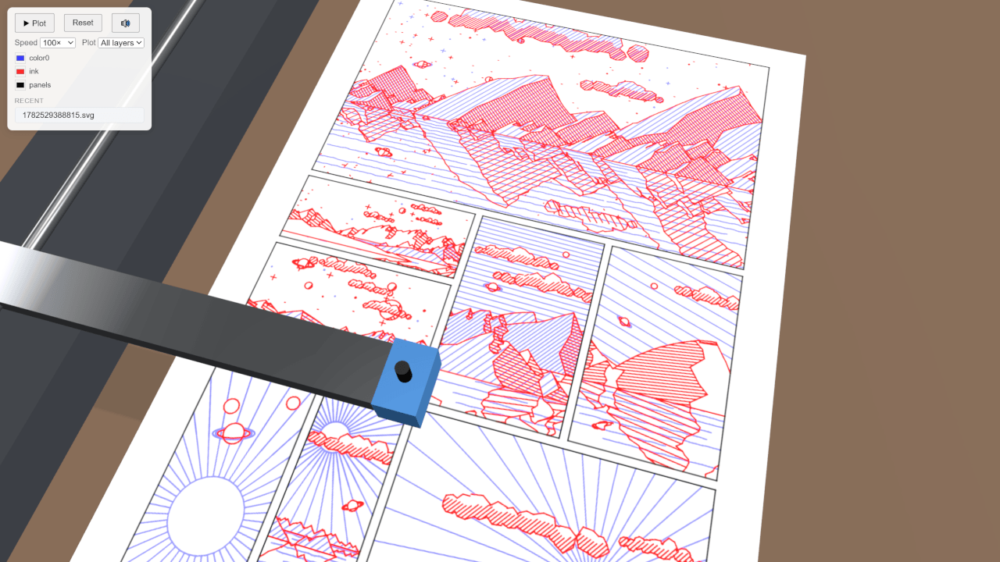

# Virtual Plotter

A 3D pen-plotter simulator in the browser. Drop in an SVG and watch a little
AxiDraw-style machine draw it on virtual paper — arm sliding, pen lifting,
stepper motors whirring. It doesn't make anything real but it's nice to watch.

# [LIVE DEMO](https://killedbyapixel.github.io/VirtualPlotter/)

## How To Use

Drag any SVG file onto the page and it loads onto the plotter. Then:

- **▶ Plot / ❚❚ Pause** — run or pause the drawing
- **Reset** — clear the ink and send the pen home
- **Speed** — 1× (real time) up to 1000× for the impatient
- **Plot** — draw all layers, or just one
- **Pens** — pick a pen in the panel or by clicking one in the caddy. Every
  pen's ink color and tip size are editable; each has its own line character
  (the marker blobs, the ballpoint dry-starts, the brush swells) and its ink
  runs down as you plot — levels persist between visits. **Fresh** replaces a
  dead pen, or untick **Ink simulation** for perfect ink with none of that.
- **Paper** — choose a paper type in the panel or click the stack beside the
  machine: bristol, watercolor (toothy), cheap copy (bleeds a little), or
  black card (that's what the gel and metallic pens are for). The color
  picker overrides the sheet color.
- **Layer colors** — pick a pen color per layer before you start (Inkscape layers
  are detected automatically)
- **🔊** — mute the motor and servo sounds (they only play at 1× speed anyway)
- **F** — toggle a free-fly camera: the mouse locks for looking around and
  WASD + E/Q fly you through the scene; press F (or Esc) to return to orbit
- **H** — hide/show the whole interface (handy for a clean screenshot)

Recently plotted files are remembered so you can replay them. On a first
visit the Recent list starts with a built-in sample, so there's something to
plot before you have an SVG of your own.

## License

Copyright (C) 2026 Frank Force.

Released under the **GNU General Public License v3.0** — see [LICENSE](LICENSE).
You're free to use, study, share, and modify it, but any version you distribute
has to stay open source under the same license.
